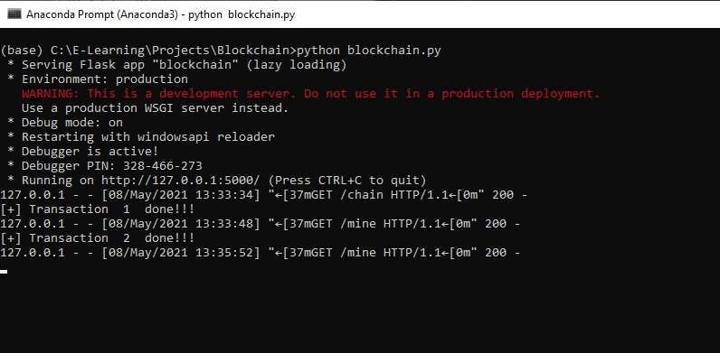
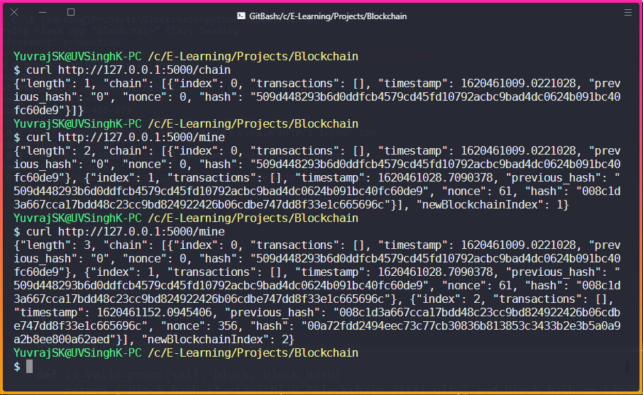

# Blockchain_from_scratch
This repository contains Implementation of blockchain from scratch using python


### Steps:
```bash
$ git clone https://github.com/YuvrajSingh-16/Blockchain_from_scratch.git
$ cd Blockchain_from_scratch
$ python blockchain.py
```

### Working:




<p align="center"><b>Server Up and running<b></p>





<p align="center"><b>Making Mine requests to the server<b></p>
